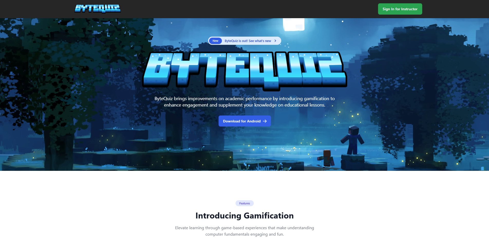

# ByteQuiz Dashboard Site

A landing page and web panel from Firebase for the ByteQuiz android quiz game



## ✨ Features

- 🔒 **Instructor Authentication**: Secure login and personalized access for authorized instructors.
- 🧑‍🏫 **Classroom Management**: Instructors can manage classrooms, tracking student's activities.
- 🗄️ **Export to Excel**: Activities can be exported to spreadsheet using `exceljs` library.
- 📱 **Responsive Design**: Built with Tailwind CSS for responsiveness and modern design.

## 🏗️ Built With

- **[React](https://react.dev/)**: A JavaScript library for building fast and interactive user interfaces with a component-based architecture.
- **[Tailwind](https://tailwindcss.com/)**: A utility-first CSS framework for creating responsive and modern designs with ease.
- **[Firebase](https://firebase.google.com/)**: A backend-as-a-service platform providing authentication and real-time database for the application.
- **[exceljs](https://github.com/exceljs/exceljs#readme)**: A powerful library for creating, reading, and manipulating Excel files in JavaScript.

## 🛠️ Installation

To set up and run this project, follow these steps:

1. Clone the repository:

   ```
   git clone git@github.com:belsua/bytequiz-site.git
   ```

2. Navigate to the project directory:

   ```
   cd bytequiz-site
   ```

3. Install dependencies:

   ```
   npm install
   ```

4. Run the development server:

   ```
   npm run dev
   ```

   This will start the development server and you should be able to access the application at `http://localhost:5173` in your browser.

Note: Make sure you have Node.js and npm installed on your system before running these steps.

